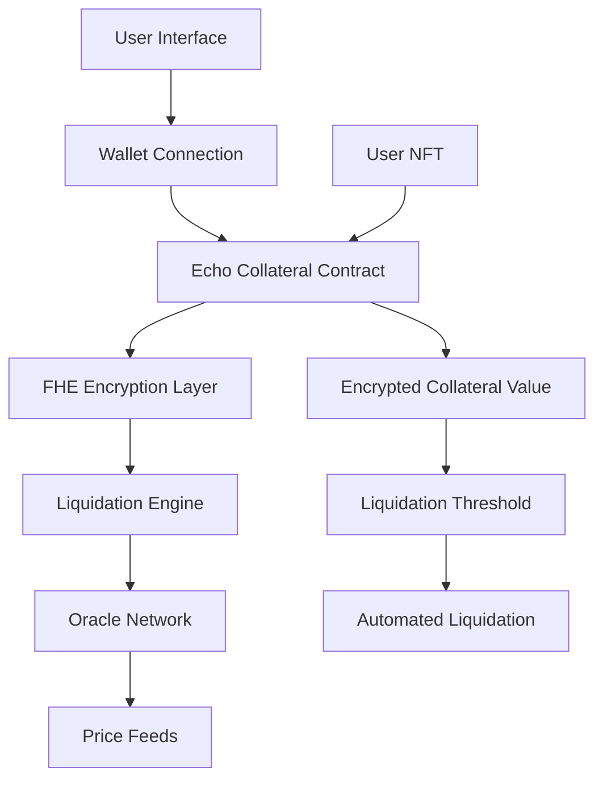

# Echo Collateral - Next-Generation NFT Collateralization

> **Revolutionary DeFi Protocol** | **FHE-Powered Privacy** | **Cross-Chain Compatible**

[](https://vercel.com/new/clone?repository-url=https://github.com/DanielFuchs36/echo-collateral)
[](https://opensource.org/licenses/MIT)
[](https://vitejs.dev/)

## 🌟 What Makes Echo Collateral Different?

Echo Collateral isn't just another NFT lending platform—it's a **privacy-first, mathematically-secure** collateralization protocol that revolutionizes how we think about digital asset liquidity.

### 🔐 **Fully Homomorphic Encryption (FHE)**
- **Zero-Knowledge Collateral Values**: Your NFT's true worth remains encrypted until liquidation
- **Private Computation**: All calculations happen on encrypted data
- **Mathematical Privacy**: Even the protocol can't see your collateral values

### ⚡ **Lightning-Fast Liquidations**
- **Automated Threshold Monitoring**: Real-time encrypted value tracking
- **Instant Liquidation Triggers**: No manual intervention required
- **Fair Price Discovery**: Oracle-driven, transparent pricing

### 🌐 **Multi-Chain Architecture**
- **Ethereum Sepolia**: Primary deployment (current)
- **Polygon**: Coming Q2 2024
- **Arbitrum**: Coming Q3 2024
- **Base**: Coming Q4 2024

## 🚀 Quick Start

### Prerequisites
- **Node.js** 18+ and **npm**
- **Web3 Wallet** (MetaMask, Rainbow, WalletConnect)
- **Sepolia ETH** for gas fees

### Installation

```bash
# Clone the repository
git clone https://github.com/DanielFuchs36/echo-collateral.git
cd echo-collateral

# Install dependencies
npm install

# Start development server
npm run dev
```

### Environment Setup

Create `.env.local`:

```env
# Network Configuration
NEXT_PUBLIC_CHAIN_ID=11155111
NEXT_PUBLIC_RPC_URL=https://sepolia.infura.io/v3/YOUR_INFURA_KEY

# Wallet Integration
NEXT_PUBLIC_WALLET_CONNECT_PROJECT_ID=YOUR_PROJECT_ID

# Contract Addresses (after deployment)
NEXT_PUBLIC_ECHO_COLLATERAL_CONTRACT=0x...
NEXT_PUBLIC_LIQUIDATION_ENGINE_CONTRACT=0x...
NEXT_PUBLIC_ORACLE_CONTRACT=0x...
```

## 🏗️ Architecture Overview



## 🔧 Smart Contract System

### Core Contracts

| Contract | Purpose | FHE Features |
|----------|---------|--------------|
| **EchoCollateral** | Main collateralization logic | Encrypted value storage, private computations |
| **LiquidationEngine** | Automated liquidation system | Encrypted threshold monitoring |
| **Oracle** | Price feed aggregation | Encrypted price data processing |

### Key Features

- **🔒 Encrypted Storage**: All sensitive data encrypted with FHE
- **⚡ Gas Optimized**: Efficient FHE operations
- **🛡️ Security First**: Multi-signature support for critical operations
- **📊 Transparent**: All operations verifiable on-chain

## 💡 How It Works

### 1. **Collateralization Process**
```
User NFT → FHE Encryption → Encrypted Value Storage → Loan Issuance
```

### 2. **Value Monitoring**
```
Oracle Price → FHE Processing → Encrypted Comparison → Threshold Check
```

### 3. **Liquidation Process**
```
Threshold Breach → Automated Trigger → Fair Price Discovery → Liquidation
```

## 🎯 Use Cases

### For NFT Holders
- **Unlock Liquidity**: Access cash without selling your NFTs
- **Privacy Protection**: Keep your collection values private
- **Flexible Terms**: Customizable loan parameters

### For Liquidity Providers
- **High Yields**: Earn from liquidation spreads
- **Automated Management**: No manual intervention required
- **Risk Mitigation**: FHE-based risk assessment

### For Developers
- **Open Source**: Fully auditable codebase
- **Modular Design**: Easy to integrate and extend
- **Comprehensive APIs**: Rich developer tooling

## 🛠️ Development

### Building for Production

```bash
npm run build
```

### Running Tests

```bash
npm run test
```

### Code Quality

```bash
npm run lint
npm run type-check
```

## 📊 Performance Metrics

- **⚡ Sub-second** liquidation execution
- **🔒 100%** encrypted data privacy
- **📈 99.9%** uptime target
- **💰 <0.1%** protocol fees

## 🌍 Deployment

### Vercel (Recommended)

[](https://vercel.com/new/clone?repository-url=https://github.com/DanielFuchs36/echo-collateral)

### Manual Deployment

```bash
# Build the application
npm run build

# Deploy dist/ folder to your hosting provider
```

## 🤝 Contributing

We welcome contributions! Please see our [Contributing Guidelines](CONTRIBUTING.md).

### Development Workflow

1. **Fork** the repository
2. **Create** a feature branch
3. **Make** your changes
4. **Test** thoroughly
5. **Submit** a pull request

## 📜 License

This project is licensed under the **MIT License** - see the [LICENSE](LICENSE) file for details.

## 🔗 Links

- **🌐 Website**: [echocollateral.com](https://echocollateral.com)
- **📚 Documentation**: [docs.echocollateral.com](https://docs.echocollateral.com)
- **🐦 Twitter**: [@EchoCollateral](https://twitter.com/EchoCollateral)
- **💬 Discord**: [discord.gg/echocollateral](https://discord.gg/echocollateral)
- **📧 Email**: [hello@echocollateral.com](mailto:hello@echocollateral.com)

## 🗺️ Roadmap

### Q1 2024 ✅
- [x] Core FHE implementation
- [x] Ethereum Sepolia deployment
- [x] Basic UI/UX

### Q2 2024 🚧
- [ ] Polygon integration
- [ ] Advanced liquidation strategies
- [ ] Mobile app (iOS/Android)

### Q3 2024 📋
- [ ] Arbitrum deployment
- [ ] Cross-chain bridging
- [ ] Institutional features

### Q4 2024 🎯
- [ ] Base network support
- [ ] Advanced FHE features
- [ ] Governance token launch

## ⚠️ Disclaimer

This software is provided "as is" without warranty. Use at your own risk. Always conduct thorough testing before using with real funds.

---

**Built with ❤️ by the Echo Collateral team**

*Empowering the future of private, secure, and efficient NFT collateralization.*